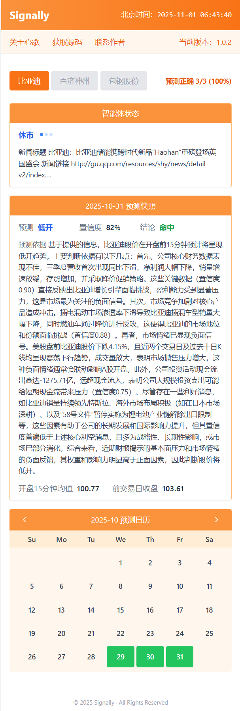

# 心歌（Signally）

> 🧠 一款基于智能体框架的实时股票价格预测与量化交易系统  
> *Signally — A real-time stock prediction and quantitative trading system powered by Agent architecture.*

---

https://www.signally.ink/

## 📜 免责声明 | Disclaimer

**心歌（Signally）** 仅用于学术研究与作者个人研究使用。  
作者不对他人参考、复现或使用本软件所生成信息而造成的任何金融投资损失承担责任。  
请使用者在使用前，充分理解投资风险并自行承担后果。

**Signally** is intended **solely for academic research and personal use**.  
The author bears **no responsibility** for any financial loss resulting from others using or referencing this software or its generated information.  
Users must fully understand the risks of investment and assume all responsibilities.

---

## 💡 项目简介 | Introduction

**心歌（Signally）** 是一款基于 **智能体（Agent）框架** 构建的、  
支持 **实时股票价格预测** 与 **量化交易分析** 的实验性系统。  
它旨在探索智能体在金融数据感知、推理与辅助决策领域的潜在应用。

**Signally** is an experimental system built on an **Agent-based architecture**,  
designed for **real-time stock price prediction** and **quantitative trading analysis**.  
It explores how intelligent agents can perceive, reason, and assist decision-making in financial contexts.

---

## ⚙️ 当前版本 | Current Version

**Version: v1.0.2**

**主要功能 | Core Features:**
1. 实时监控 **比亚迪（A股）** 股票价格动态；  
2. 自动从互联网公开网站收集与比亚迪相关的多维度信息；  
3. 借助大型语言模型 **Gemini** 预测当日开盘价格，并生成预测依据；  
4. 记录并统计历史预测结果。

**Features:**
1. Real-time monitoring of **BYD (A-share)** stock prices;  
2. Automated collection of multi-source online information related to BYD;  
3. Daily **opening price prediction** using the **Gemini LLM**, with reasoning output;  
4. Historical prediction tracking and statistical summaries.

---

## 🌟 项目特色 | Highlights

在当前众多基于大语言模型的量化系统中，大多数依赖昂贵的 LLM 调用成本或付费平台集成。  
**心歌（Signally）** 的最大特色在于其 **“完全免费”** 的设计理念。  

- 🆓 **免费原则**：从数据采集到模型调用，尽量采用开源或免费方案；  
- 🧩 **智能体框架**：以模块化方式构建感知、推理与执行链路；  
- ⚡ **实时响应**：具备实时行情监控与动态信息收集能力；  
- 💬 **可解释预测**：输出模型预测依据，便于研究与分析。

Among existing LLM-based quantitative trading systems, most rely on **expensive API calls** or **paid integrations**.  
**Signally** distinguishes itself with a **“free and open”** philosophy:

- 🆓 **Free-first principle:** uses open or cost-free sources and models wherever possible;  
- 🧩 **Agent-based design:** modular architecture for perception, reasoning, and execution;  
- ⚡ **Real-time capability:** live market tracking and online data aggregation;  
- 💬 **Explainable reasoning:** model outputs include rationale for each prediction.

---

## 🧭 设计理念 | Design Philosophy

**心歌（Signally）** 并非一款商业化交易产品，  
而是一场以 **极客精神（Geek Spirit）** 为内核、  
以 **智能体框架** 为骨架、  
以 **极简主义（Minimalism）** 为美学的实验性探索。  

它希望证明：即便在有限资源条件下，研究者也能构建出具备实时感知与推理能力的完整智能体系统。

**Signally** is not a commercial trading product,  
but an experimental exploration grounded in **Geek Spirit**,  
structured upon **Agent frameworks**,  
and inspired by **Minimalist design**.  

It demonstrates that even with limited resources, it’s possible to build an intelligent system capable of real-time perception and reasoning.

---

## 🧩 开源与学习 | Open Source & Learning

**心歌（Signally）** 的源代码已完全开源，欢迎技术爱好者与研究者共同学习、讨论与改进。  
该项目意在促进对智能体与量化金融结合的理解，而非提供投资建议。

The **Signally** source code is fully open-sourced.  
Developers and researchers are welcome to **study, discuss, and extend** the project.  
This project aims to foster exploration at the intersection of intelligent agents and quantitative finance — **not to provide investment guidance**.

---

## ⚠️ 重要声明 | Important Note

所有量化交易系统的预测结果都仅供 **辅助决策参考**。  
作者始终坚持“**股票价格无法被预测**”的基本理念，  
无论是否采用人工智能技术，市场的不确定性都应被尊重。

All predictions generated by Signally are **for research and decision-support purposes only**.  
The author firmly believes that **stock prices cannot be predicted**,  
and that the uncertainty of financial markets must always be acknowledged — even with AI involvement.

---

## 🧱 License

This project is released under the **MIT License**.  
See the [LICENSE](./LICENSE) file for details.

---

## 📬 Contact

Author: **Jacky Zhang**  
Project: [Signally](https://github.com/hzhan11/signally)  
Email: xjtu_xiangxiang@hotmail.com
Wechat: hzhan11
